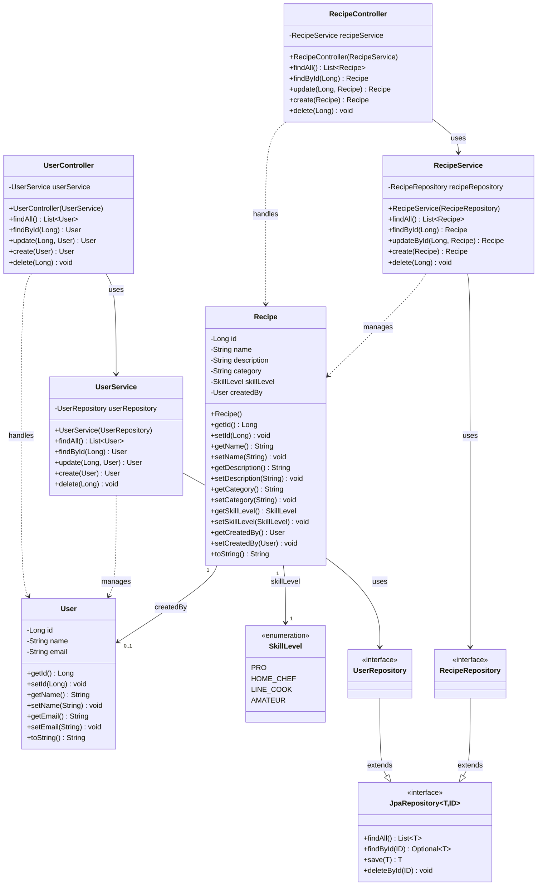

# Repository Overview

This repository houses the 3 versions of code being written to research and test the efficacy of code generation tools for modern Spring based Java applications.

[01_manual](./01_manual/): Contains all manually written code and statistics for this code.  This is considered the baseline that all other code generation output will be compared against.

[02_star-uml](./02_star-uml/): Contains all output and statistics for code generation completed through StarUML.

[03_papyrus](./03_papyrus/): Contains all output and statistics for code generation completed through Eclipse Papyrus.

## Baseline UML outline

Below is the overall class diagram that will be recreated in both StarUML and Papyrus.  This class diagram is reverse engineered based on the final Manual code written as that is the acting baseline for this research.

Note that this diagram is meant for reference only, not all elements will be strictly used based on the capabilities of the simplest code generation components of each tool.  It will also be restructured into a package format for each tool to facilitate directory structure generation.  Overall time to recreate each model will be used as an additional comparison point to give quantitative data on the user experience for each tool.

## Additional tools used

For the various line counts and other metrics collected on the final generated code, a script was developed to automatically count and extract different metrics from each code base.  This is built with the intention of being use din a Debian based linux distribution and is contained in the [04_tool-scripts](./04_tool-scripts/) folder.
